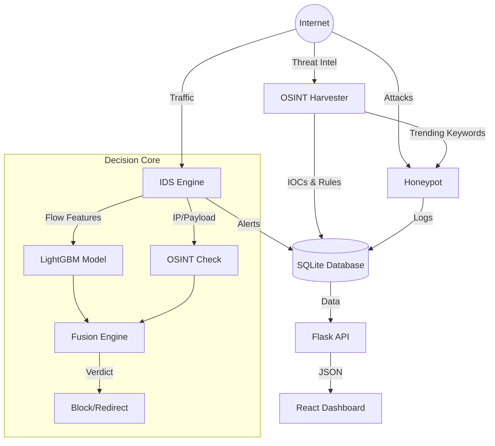

# AURA - Adaptive Unified Response Agent
## Technical Reference Manual

**Version:** 1.0.0
**Date:** 2025-12-11
**Author:** AURA Development Team

---

## 1. Project Overview

AURA (Adaptive Unified Response Agent) is a next-generation cybersecurity platform designed to provide proactive defense through the fusion of Machine Learning (ML), Open Source Intelligence (OSINT), and Adaptive Deception (Honeypots).

Unlike traditional Intrusion Detection Systems (IDS) that rely solely on static signatures, AURA dynamically adapts to new threats by:
1.  **Harvesting Intelligence:** Continuously scanning the web (Reddit, GitHub, CISA) for emerging CVEs and exploit PoCs.
2.  **Fusion Detection:** Combining ML-based anomaly detection with real-time OSINT reputation scoring.
3.  **Adaptive Deception:** Dynamically updating honeypot credentials and vulnerabilities to match trending threats.

### Core Philosophy
*   **Proactive vs. Reactive:** Don't just wait for an attack; anticipate it using OSINT.
*   **Fusion Logic:** A single signal is weak; multiple signals (ML + Intel + History) are strong.
*   **Deception as Defense:** Waste attacker time and gather high-fidelity intelligence using honeypots.

---

## 2. System Architecture

The system is composed of four loosely coupled but highly integrated modules:

1.  **IDS Engine (Intrusion Detection System):** The "eyes" of the system. Sniffs network traffic, extracts features, and applies ML models.
2.  **OSINT Harvester:** The "brain" of the system. Scrapes external sources for threat intelligence.
3.  **Honeypot (Cowrie):** The "trap". A high-interaction SSH/Telnet honeypot that logs attacker behavior.
4.  **Dashboard & API:** The "face". A React/Flask interface for monitoring and control.

### High-Level Data Flow



---

## 3. Directory Structure

The project is organized as follows:

```
AURA/
├── dashboard/              # Web Interface
│   ├── api/                # Flask Backend
│   └── frontend/           # React Frontend (Vite)
├── database/               # SQLite Database & Schema
├── docs/                   # Documentation
├── HONEYPOT/               # Deception Module
│   ├── controller.py       # Adaptive Logic
│   └── log_bridge.py       # Cowrie -> DB Bridge
├── IDS/                    # Intrusion Detection Module
│   ├── core/               # Detection Logic (Flow, Fusion, JA3)
│   ├── models/             # Trained ML Models
│   └── main.py             # IDS Entry Point
├── osint-harvester/        # Threat Intelligence Module
│   ├── data/               # Raw & Parsed Feeds
│   └── main.py             # Harvester Entry Point
├── start.py                # Master Startup Script
└── requirements.txt        # Python Dependencies
```

---

## 4. Module Details

### A. Intrusion Detection System (IDS)

**Location:** `IDS/`
**Entry Point:** `IDS/main.py`

The IDS is a hybrid system combining signature-based checks (OSINT) with anomaly detection (Machine Learning).

#### Core Components:

1.  **Detector (`IDS/core/detector.py`)**:
    *   **Function:** Orchestrates the entire detection pipeline.
    *   **Logic:**
        1.  **Packet Capture:** Uses `scapy` to sniff packets.
        2.  **Allowlist Check:** Skips local/trusted IPs.
        3.  **OSINT Check:** Checks IP against known malicious IPs and payload against regex rules.
        4.  **JA3 Fingerprinting:** Calculates TLS client fingerprints (`IDS/core/ja3_analyzer.py`) and checks against a blacklist.
        5.  **Flow Extraction:** Aggregates packets into flows (SrcIP, DstIP, Port, Proto) using `IDS/core/flow_generator.py`.
        6.  **ML Inference:** If flow is complete, extracts 78 statistical features and queries the LightGBM model.
        7.  **Fusion:** Passes ML confidence and OSINT verdict to the Fusion Engine.

2.  **Fusion Engine (`IDS/core/fusion_engine.py`)**:
    *   **Algorithm:** Weighted Linear Combination with Veto.
    *   **Formula:** `Score = (0.5 * ML_Score) + (0.3 * OSINT_Score) + (0.2 * Trend_Score)`
    *   **Veto Logic:**
        *   If `OSINT_Score >= 1.0` (Known Bad IP) -> **BLOCK** immediately.
        *   If `ML_Score > 0.95` (High Confidence Attack) -> **BLOCK** immediately.
    *   **Verdicts:**
        *   `BLOCK` (Score > 0.8): Drops packet via `iptables`.
        *   `REDIRECT` (Score 0.5 - 0.8): Logs alert (future: route to honeypot).
        *   `PASS` (Score < 0.5): Benign traffic.

3.  **ML Model (`IDS/models/`)**:
    *   **Type:** LightGBM Classifier.
    *   **Training Data:** CIC-IDS2017 Dataset.
    *   **Features:** 78 network flow features (Duration, Bwd Packet Length Mean, Flow IAT Std, etc.).
    *   **Performance:** ~99.9% Accuracy on test set.

#### Running the IDS:
```bash
sudo ./venv/bin/python IDS/main.py --interface eth0
```
*Note: Root privileges are required for packet sniffing and iptables manipulation.*

---

### B. OSINT Harvester

**Location:** `osint-harvester/`
**Entry Point:** `osint-harvester/main.py`

The Harvester gathers threat intelligence from the open web to inform the IDS and Honeypot.

#### Core Components:

1.  **CVE Fetcher (`cve_fetcher.py`)**:
    *   Fetches latest vulnerabilities from NVD (National Vulnerability Database) API.
    *   Filters by keyword (e.g., "IoT", "SQL") and severity.

2.  **Live Threat Feeds (`live_threat_feeds.py`)**:
    *   **Reddit:** Scrapes `/r/netsec` and `/r/cybersecurity` for trending discussions.
    *   **GitHub:** Searches for recently updated repositories matching "CVE" or "PoC".
    *   **CISA:** Fetches the Known Exploited Vulnerabilities (KEV) catalog.

3.  **Threat Forecaster (`threat_forecaster.py`)**:
    *   **Algorithm:** Momentum-based Trending Score.
    *   **Logic:** Analyzes the rate of mentions of a CVE over time on social platforms.
    *   **Formula:** `Score = (0.6 * Acceleration) + (0.4 * Momentum)`
    *   **Output:** A list of "Trending CVEs" that are likely to be exploited soon.

4.  **Standardizer (`utils/standardizer.py`)**:
    *   Consolidates all raw data (CVEs, Reddit posts, GitHub repos) into a single `intelligence_feed.json`.
    *   Extracts IPs, Hashes, and Keywords (Tags).

#### Running the Harvester:
```bash
./venv/bin/python osint-harvester/main.py --live --forecast
```

---

### C. Honeypot (Adaptive Deception)

**Location:** `HONEYPOT/`
**Entry Point:** `HONEYPOT/controller.py`

AURA uses **Cowrie**, a medium-to-high interaction SSH/Telnet honeypot, wrapped with a custom controller.

#### Core Components:

1.  **Controller (`HONEYPOT/controller.py`)**:
    *   **Function:** Makes the honeypot "Adaptive".
    *   **Logic:**
        1.  Reads `data/intelligence_feed.json` generated by the OSINT module.
        2.  Scans for keywords (e.g., "D-Link", "Hikvision", "IoT").
        3.  Dynamically updates `userdb.txt` (allowed credentials) to include factory default passwords for those devices.
        4.  *Result:* If attackers are scanning for "D-Link" routers, the honeypot *becomes* a D-Link router (accepts those creds).

2.  **Log Bridge (`HONEYPOT/log_bridge.py`)**:
    *   **Function:** Parses Cowrie's JSON logs (`var/log/cowrie/cowrie.json`).
    *   **Logic:** Detects events like `cowrie.login.success`, `cowrie.command.input`, `cowrie.session.file_download`.
    *   **Output:** Writes structured alerts to the central SQLite database (`alerts` table).

#### Running the Honeypot:
The honeypot is typically run via Docker or a system service, but the controller runs as a standalone script:
```bash
./venv/bin/python HONEYPOT/controller.py
```

---

### D. Dashboard & API

**Location:** `dashboard/`
**Entry Point:** `dashboard/api/app.py`

The control center for AURA.

#### Core Components:

1.  **Flask API (`dashboard/api/app.py`)**:
    *   **Endpoints:**
        *   `GET /api/dashboard`: Summary stats (Total Threats, Block Rate).
        *   `GET /api/alerts`: List of recent alerts.
        *   `GET /api/control/<service>/<action>`: Start/Stop IDS, OSINT, or Honeypot.
        *   `GET /api/alerts/assess`: Review workflow for analysts.
    *   **Database Integration:** Connects to `database/aura.db` to read/write alerts and status.

2.  **React Frontend (`dashboard/frontend/`)**:
    *   **Tech Stack:** React, Vite, TailwindCSS, Recharts.
    *   **Pages:**
        *   **Dashboard:** Real-time graphs and counters.
        *   **Alerts:** Detailed table of security events.
        *   **Review:** Interface for labeling alerts (True/False Positive) to retrain the model.
        *   **Settings:** System configuration and service status control.

#### Running the Dashboard:
**Backend:**
```bash
./venv/bin/python dashboard/api/app.py
```
**Frontend:**
```bash
cd dashboard/frontend
npm run dev
```

---

## 5. Database Schema

**File:** `database/aura.db` (SQLite)

### Table: `alerts`
Stores all security events.
*   `id`: PK
*   `timestamp`: Time of event
*   `src_ip`: Attacker IP
*   `alert_type`: 'OSINT', 'ML', 'HEURISTIC', 'JA3', 'FUSION'
*   `severity`: 'LOW', 'MEDIUM', 'HIGH', 'CRITICAL'
*   `description`: Human-readable reason
*   `action_taken`: 'BLOCKED', 'LOGGED'
*   `review_status`: 'pending', 'approved', 'rejected' (for RLHF)

### Table: `flows`
Stores raw network traffic features for model retraining.
*   `features`: JSON string of 78 extracted features.
*   `label`: 'MALICIOUS' or 'BENIGN'.

### Table: `osint_rules`
Stores active threat intelligence.
*   `rule_value`: IP address, Regex pattern, or Hash.
*   `rule_type`: 'ipv4', 'micro_rule', 'ja3_hash'.

---

## 6. Installation & Setup

### Prerequisites
*   Python 3.10+
*   Node.js 18+
*   `libpcap-dev` (for Scapy)
*   `iptables` (for blocking)

### Step 1: Clone & Install Dependencies
```bash
git clone https://github.com/yourusername/AURA.git
cd AURA

# Create Virtual Environment
python3 -m venv venv
source venv/bin/activate

# Install Python Deps
pip install -r requirements.txt

# Install Frontend Deps
cd dashboard/frontend
npm install
cd ../..
```

### Step 2: Initialize Database
```bash
python3 database/init_service_status.py
```

### Step 3: Setup Permissions
```bash
sudo chmod +x setup_ids_permissions.sh
./setup_ids_permissions.sh
```

---

## 7. Running the System

You can run each module individually (see above) or use the master script.

### Master Startup Script
This script launches the API, Frontend, IDS, Honeypot Controller, and OSINT Harvester in background processes.

```bash
sudo ./venv/bin/python start.py
```

*   **Access Dashboard:** `http://localhost:5173`
*   **Access API:** `http://localhost:5000`

### Stopping the System
Press `Ctrl+C` in the terminal running `start.py`. The script handles graceful shutdown of all child processes.

---

## 8. Algorithms & Logic

### Feature Extraction (IDS)
We use a custom implementation of the CICFlowMeter logic.
*   **Key Features:**
    *   `Flow Duration`
    *   `Total Fwd/Bwd Packets`
    *   `Packet Length Mean/Std/Max`
    *   `Flow IAT (Inter-Arrival Time)`
    *   `Flag Counts (SYN, FIN, RST, PSH)`

### Threat Forecasting (OSINT)
We treat CVE mentions as a time-series signal.
1.  **Data Collection:** Count mentions per day for each CVE.
2.  **Momentum Calculation:** Use Linear Regression on the last 5 days of counts to find the slope (trend).
3.  **Acceleration:** Calculate the difference between today's and yesterday's count.
4.  **Scoring:** Combine them to find "viral" vulnerabilities before they are widely exploited.

### Adaptive Honeypot
1.  **Input:** OSINT tags (e.g., "Mirai", "IoT", "Hikvision").
2.  **Mapping:** A predefined dictionary maps tags to credentials (e.g., "Hikvision" -> `admin:12345`).
3.  **Action:** The controller writes these credentials to `userdb.txt`.
4.  **Effect:** Cowrie reloads this file. When a Mirai bot tries `admin:12345`, it succeeds, allowing us to capture the subsequent payload (the malware binary).

---

## 9. Troubleshooting

*   **IDS Error: "Operation not permitted"**: You must run `start.py` or `IDS/main.py` with `sudo`.
*   **ModuleNotFoundError**: Ensure you are using the python executable inside `venv/bin/python`.
*   **Database Locked**: SQLite handles concurrency poorly with high writes. If this happens, restart the API.
*   **Frontend Connection Refused**: Ensure the Flask API is running on port 5000.
